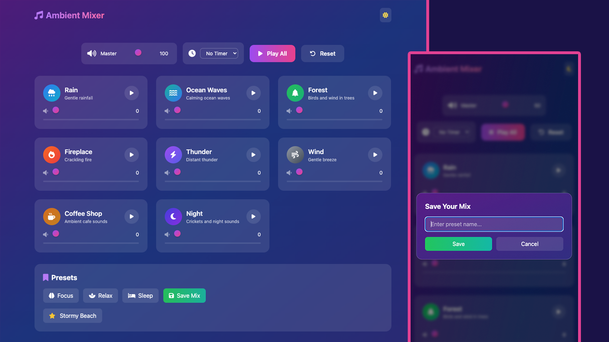

# Ambient Sound Mixer 🎵

Create your perfect atmosphere with this beautiful and intuitive ambient sound mixer. Mix and match various nature sounds, white noise, and ambient audio to enhance focus, relaxation, or sleep.

This is part of my [Modern JS From The Beginning 2.0 course(https://www.traversymedia.com/modern-javascript-2-0). So no pull requests will be accepted. The code has to match the course.

The theme (HTML/CSS/Audio Only) is in <a href="https://github.com/bradtraversy/ambient-sound-mixer/tree/main/ambient-sound-mixer-template">/ambient-sound-mixer-template</a>

## ✨ Features

### 🎛️ Sound Mixing

- **12+ High-Quality Ambient Sounds** - Rain, thunderstorm, ocean waves, forest, fireplace, wind, white noise, coffee shop ambience, and more
- **Individual Volume Controls** - Fine-tune each sound independently with smooth volume sliders
- **Master Volume Control** - Adjust overall mix volume instantly
- **Play/Pause Individual Sounds** - Toggle sounds on/off while maintaining volume settings
- **Visual Feedback** - Animated sound cards with hover effects and play state indicators

### 🎨 Presets & Customization

- **Built-in Presets** - Quick access to pre-made mixes:
    - 🧠 **Focus** - Optimized for concentration and productivity
    - 🧘 **Relax** - Perfect for meditation and unwinding
    - 😴 **Sleep** - Gentle sounds to help you fall asleep
- **Save Custom Presets** - Create and save your own perfect sound combinations
- **Persistent Storage** - Your custom presets are saved locally and available on return visits
- **Delete Custom Presets** - Remove unwanted saved presets with a simple click

### ⏱️ Timer Features

- **Sleep Timer** - Set automatic stop timers (5, 15, 30, or 60 minutes)
- **Visual Countdown** - See remaining time at a glance
- **Auto-Stop** - All sounds fade out smoothly when timer expires

### 🎨 User Interface

- **Dark/Light Theme Toggle** - Switch between beautiful dark and light color schemes
- **Responsive Design** - Works perfectly on desktop, tablet, and mobile devices
- **Smooth Animations** - Polished transitions and hover effects
- **Gradient Backgrounds** - Dynamic color gradients that adapt to theme
- **Backdrop Blur Effects** - Modern glassmorphism design elements

### 🔧 Technical Features

- **No Installation Required** - Runs directly in your browser
- **Offline Support** - Once loaded, works without internet connection
- **LocalStorage Integration** - Saves your preferences and custom presets
- **Modular Architecture** - Clean, maintainable code structure
- **ES6 Modules** - Modern JavaScript with proper separation of concerns

## 🚀 Getting Started

### Quick Start

1. Clone or download this repository
2. Open `index.html` in your web browser
3. Start mixing your perfect ambient soundscape!

## 🎵 Available Sounds

- 🌧️ **Rain** - Gentle rainfall
- 🌊 **Ocean Waves** - Calming ocean waves
- 🌲 **Forest** - Birds and wind in trees
- 🔥 **Fireplace** - Crackling fire
- ⚡ **Thunder** - Distant thunder
- 💨 **Wind** - Gentle breeze
- ☕ **Coffee Shop** - Ambient cafe sounds
- 🌙 **Night** - Crickets and night sounds

## 💡 Usage Tips

### Creating the Perfect Mix

1. Start with a base sound (rain, ocean, or white noise)
2. Layer in complementary sounds at lower volumes
3. Adjust master volume to comfortable level
4. Save your mix as a custom preset for quick access

### Recommended Combinations

- **Deep Focus**: White noise (50%) + Rain (30%) + Coffee shop (20%)
- **Meditation**: Ocean waves (60%) + Wind (20%) + Forest (20%)
- **Cozy Evening**: Fireplace (70%) + Rain (30%)
- **Sleep Aid**: Pink noise (40%) + Ocean waves (30%) + Wind (30%)

## 🛠️ Technologies Used

- **HTML5** - Semantic markup
- **Tailwind CSS** - Utility-first styling
- **JavaScript (ES6+)** - Modern JavaScript with modules
- **Font Awesome** - Icon library
- **Web Audio API** - Audio playback and control
- **LocalStorage API** - Persistent data storage

## 📝 Browser Compatibility

- Chrome 90+
- Firefox 88+
- Safari 14+
- Edge 90+
- Opera 76+

## 🤝 Contributing

Contributions are welcome! Feel free to:

1. Fork the repository
2. Create a feature branch
3. Make your changes
4. Submit a pull request

### Ideas for Contribution

- Add more ambient sounds
- Create additional preset collections
- Implement keyboard shortcuts
- Add sound visualization
- Create a PWA version
- Add cross-device sync

## 📄 License

This project is open source and available under the MIT License.

## 🙏 Acknowledgments

- Sound files sourced from royalty-free libraries
- Icons provided by Font Awesome
- Tailwind CSS for the beautiful styling system

## 📧 Contact

For questions, suggestions, or issues, please open an issue on GitHub or contact the maintainer.

---

**Enjoy creating your perfect ambient atmosphere! 🎧**
